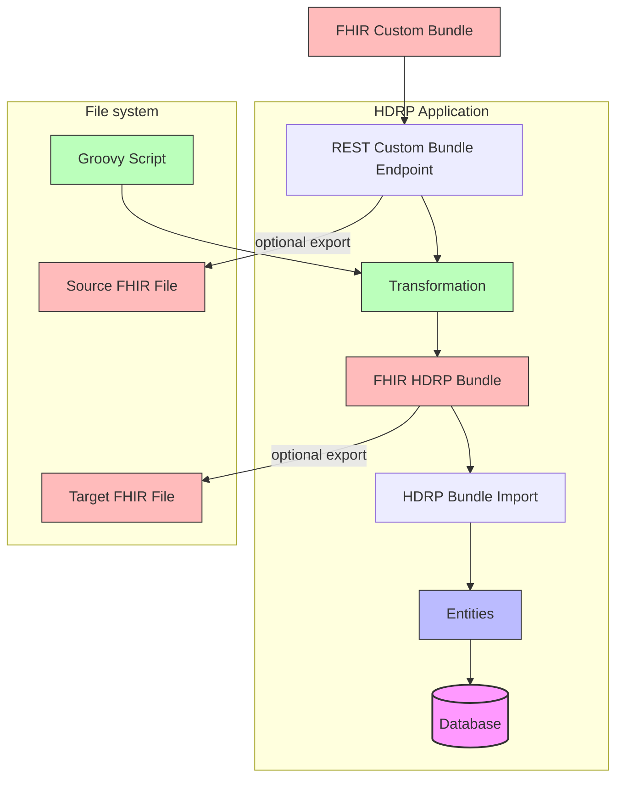

FHIR Custom Export Setup Documentation
======================================

<!-- TOC -->
* [FHIR Custom Export Setup Documentation](#fhir-custom-export-setup-documentation)
* [Introduction](#introduction)
* [HDRP global configuration](#hdrp-global-configuration)
* [Project Setup](#project-setup)
  * [Project-Specific Configuration Files](#project-specific-configuration-files)
  * [Useful Links](#useful-links)
* [Glossary](#glossary)
<!-- TOC -->

# Introduction

The HDRP FHIR Custom Import functionality allows you to Import data the by [FHIR R4](https://hl7.org/fhir/R4/index.html) format.
This document provides detailed instructions on how to set up, configure, and use this functionality.

The HDRP FHIR Custom Import enables you to transform FHIR bundle messages with any FHIR profiling into HDRP profiling and then import them.

@formatter:off

@formatter:on

# HDRP global configuration

To enable FHIR Custom Export, you need to add the following properties to the `centraxx-dev.properties` file:

```
interfaces.fhir.custom.export.scheduled.enable=<true|false>
interfaces.fhir.custom.export.incremental.enable=<true|false>
interfaces.fhir.custom.mapping.dir=C:/applications/hdrp-home/fhir-custom-mappings
```

The `interfaces.fhir.custom.mapping.dir` property specifies the directory that will contain the individual export project folders.
This directory must exist on the HDRP application server.

Each subdirectory represents an export project in the `interfaces.fhir.custom.mapping.dir`:

```
C:/applications/hdrp-home/fhir-custom-mappings/project1
C:/applications/hdrp-home/fhir-custom-mappings/project2
```

# Project Setup

To set up a new export project:

1. Create a new directory under the `interfaces.fhir.custom.mapping.dir`
2. Copy the necessary Groovy scripts file into this directory
3. Optional: Copy the [Configuration files](#project-specific-configuration-files) into this directory.
4. Restart HDRP

The directory structure will look like:

```
interfaces.fhir.custom.mapping.dir/
└── project1/
    ├── ProjectConfig.json
    ├── ExportResourceMappingConfig.json
    ├── BundleRequestMethodConfig.json
    ├── script1.groovy
    ├── script2.groovy
    └── ...
````

If not supplied, HDRP will create the `ProjectConfig.json` after restart and the `ExportResourceMappingConfig.json`
and `BundleRequestMethodConfig.json` after triggering the first export, respectively.

## Project-Specific Configuration Files

TODO

## Useful Links

- [FHIR Specification](https://hl7.org/fhir/R4/index.html)
- [Groovy Documentation](https://groovy-lang.org/documentation.html)
- [HDRP](https://www.iqvia.com/locations/emea/iqvia-connected-healthcare-platform/iqvia-health-data-research-platform)

# Glossary

- **FHIR**: Fast Healthcare Interoperability Resources, a standard for healthcare data exchange. See
- **HDRP**: Health Data Research Platform. A biobanking and clinical data management system.
- **Groovy**: A dynamic programming language for the Java virtual machine.
- **JSON**: JavaScript Object Notation, a lightweight data-interchange format
