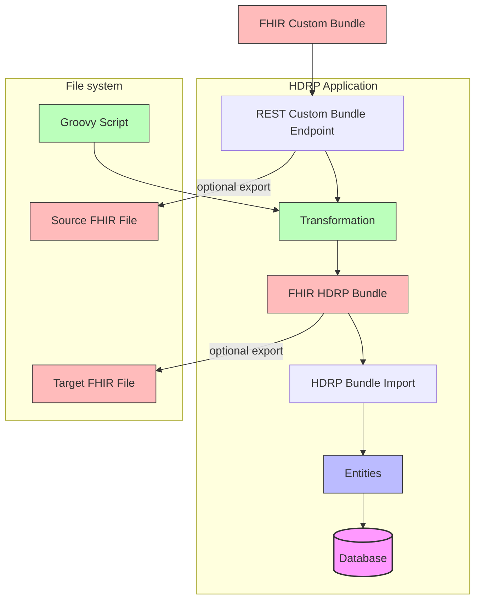

FHIR Custom Export Setup Documentation
======================================

<!-- @formatter:off -->
<!-- TOC -->
* [FHIR Custom Export Setup Documentation](#fhir-custom-export-setup-documentation)
* [Introduction](#introduction)
* [HDRP global configuration](#hdrp-global-configuration)
* [Project Setup](#project-setup)
  * [Project-Specific Configuration Files](#project-specific-configuration-files)
* [Example REST Call](#example-rest-call)
  * [Useful Links](#useful-links)
* [Glossary](#glossary)
<!-- TOC -->
<!-- @formatter:on -->

# Introduction

The HDRP FHIR Custom Import functionality allows you to Import data the by [FHIR R4](https://hl7.org/fhir/R4/index.html) format.
This document provides detailed instructions on how to set up, configure, and use this functionality.

The HDRP FHIR Custom Import enables you to transform FHIR bundle messages with any FHIR profiling into HDRP profiling and then import them.

<!-- @formatter:off -->

<!-- @formatter:on -->

# HDRP global configuration

To enable the FHIR Custom Import, you need to add the following properties to the `centraxx-dev.properties` file:

```
interfaces.fhir.custom.import.mappings=C:/applications/hdrp-home/fhir-custom-import-mappings
```

The `interfaces.fhir.custom.import.mappings` property specifies the directory that will contain the import project directory.
This directory must exist on the HDRP application server. Each subdirectory represents an import project which can specified in the Bundle import REST
call. E.g.

```
C:/applications/hdrp-home/fhir-custom-import-mappings/project1
C:/applications/hdrp-home/fhir-custom-import-mappings/project2
```

Each project can contain a set of transformation groovy files and a project specific configuration. With multiple projects HDRP can support different
FHIR profile transformations.

# Project Setup

To set up a new export project:

1. Create a new directory under the `interfaces.fhir.custom.import.mappings`
2. Copy the necessary Groovy scripts file into this directory. Examples can be found [here](../src/main/groovy/customimport).
3. Optional: Copy the [Configuration files](#project-specific-configuration-files) into this directory.
4. Restart HDRP
5. Send your custom FHIR bundles to the REST endpoint with the project name as a parameter.

The directory structure will look like:

```
interfaces.fhir.custom.import.mappings/
└── example/
    ├── ProjectConfig.json
    ├── script1.groovy
    ├── script2.groovy
    └── ...
```

If not supplied, HDRP will create the `ProjectConfig.json` after restart and the first incoming REST calls.

## Project-Specific Configuration Files

The ProjectConfig.json looks like the following.

```json
{
  "description": "This configuration specifies for each FHIR custom import project all project-specific necessary properties. The configuration can be changed during runtime.",
  "writeTransformedBundleToFileSystem": {
    "description": "If true, the transformed Bundles will be written to file system. Helpful for debugging.",
    "value": true
  },
  "transformedBundleFolder": {
    "description": "The base path in which the transformed bundles will be written.",
    "value": "C:/applications/hdrp-home/fhir-custom-import-transformed/example"
  },
  "sourceBundleFolder": {
    "description": "The base path in which the source bundles will be written.",
    "value": "C:/applications/hdrp-home/fhir-custom-import-source/example"
  },
  "writeSourceBundleToFileSystem": {
    "description": "If true, the source Bundles will be written to file system. Helpful for debugging.",
    "value": true
  }
}
```

# Example REST Call

```
curl --request POST \
  --url 'http://localhost:8090/centraxx-ui-2026.2.0-SNAPSHOT/fhir/r4/$import?project=example' \
  --header 'Authorization: Basic YWRtaW46YWRtaW4=' \
  --header 'Content-Type: application/json' \
  --data '{
	"resourceType": "Bundle",
	"type": "transaction",
	"entry": [
		{
			"fullUrl": "Patient/patient-1",
			"resource": {
				"resourceType": "Patient",
				"id": "patient-1",
				"meta": {
					"profile": [
						"https://fhir.iqvia.com/patientfinder/StructureDefinition/pf-patient"
					]
				},
				"identifier": [
					{
						"value": "patient-example-1"
					}
				],
				"name": [
					{
						"family": "Anyperson",
						"given": [
							"John",
							"B."
						]
					}
				],
				"telecom": [
					{
						"system": "phone",
						"value": "555-555-5555",
						"use": "home"
					},
					{
						"system": "email",
						"value": "john.anyperson@example.com"
					}
				],
				"gender": "male",
				"birthDate": "1951-01-20",
				"deceasedBoolean": false,
				"address": [
					{
						"line": [
							"123 Main St"
						],
						"city": "Anytown",
						"postalCode": "12345",
						"country": "US"
					}
				],
				"generalPractitioner": [
					{
						"reference": "Organization/1"
					}
				]
			},
			"request": {
				"method": "POST",
				"url": "Patient/patient-1"
			}
		}
	]
}'
```

The import reads always all Groovy files in for transformation (ordered by name) and applies each of them to the incoming bundle.
Each script should filter the incoming bundle to make sure it covers only intended resources.
It would also be possible to a multistep transformation of the same resources.

The very simple example groovy transformation file [patient.groovy](../src/main/groovy/customimport/example/patient.groovy)
would filter for all patient resources in the bundle, extracting the identifier and create a new patient resource with the same identifier but an
unknown id. Additionally, if the patient has an identifier with the code "SID", an encounter resource will be created with a reference to this
identifier.

```groovy
import de.kairos.centraxx.fhir.r4.utils.FhirUrls
import org.hl7.fhir.r4.model.Bundle
import org.hl7.fhir.r4.model.Patient
import org.hl7.fhir.r4.model.ResourceType

bundle {

  // filter for patient entries
  context.bundles.each { final def bundle ->
    bundle.getEntry().findAll { it.getResource().getResourceType() == ResourceType.Patient }
        .each {
          final Patient srcPatient = it.getResource() as Patient

          // get bundle request to set to entries. Could also transform it here.
          final Bundle.BundleEntryRequestComponent requestToSet = it.getRequest()
          entry {
            fullUrl = "something"
            resource {
              patient {
                id = "unknown"
                identifier {
                  type {
                    coding {
                      system = FhirUrls.System.IdContainerType.BASE_URL
                      code = "MPI"
                    }
                  }
                  value = srcPatient.getIdentifierFirstRep().value
                }
              }
            }
            request = requestToSet
          }

          final def sid = srcPatient.identifier.find {
            it.type.codingFirstRep.code == "SID"
          }

          if (sid != null) {
            entry {
              resource {
                encounter {
                  id = "992"
                  identifier {
                    system = FhirUrls.System.Episode.CXX_EPISODE_ID
                    value = "New Episode Id Test"
                  }

                  subject {
                    identifier = sid
                  }

                  serviceProvider = srcPatient.generalPractitioner[0]
                }
              }
              request = requestToSet
            }
          }
        }
  }
}
```

The transformed result would look like the following:

```json
{
  "resourceType": "Bundle",
  "type": "transaction",
  "entry": [
    {
      "fullUrl": "something",
      "resource": {
        "resourceType": "Patient",
        "id": "unknown",
        "identifier": [
          {
            "type": {
              "coding": [
                {
                  "system": "https://fhir.centraxx.de/system/idContainerType",
                  "code": "MPI"
                }
              ]
            },
            "value": "patient-example-1"
          }
        ]
      },
      "request": {
        "method": "POST",
        "url": "Patient/patient-1"
      }
    }
  ]
}
```

This message is forwarded to the HDRP FHIR Bundle import and processed the same way as any other Bundle by the HDRP FHIR API.

## Useful Links

- [FHIR Specification](https://hl7.org/fhir/R4/index.html)
- [Groovy Documentation](https://groovy-lang.org/documentation.html)
- [HDRP](https://www.iqvia.com/locations/emea/iqvia-connected-healthcare-platform/iqvia-health-data-research-platform)

# Glossary

- **FHIR**: Fast Healthcare Interoperability Resources, a standard for healthcare data exchange. See
- **HDRP**: Health Data Research Platform. A biobanking and clinical data management system.
- **Groovy**: A dynamic programming language for the Java virtual machine.
- **JSON**: JavaScript Object Notation, a lightweight data-interchange format
