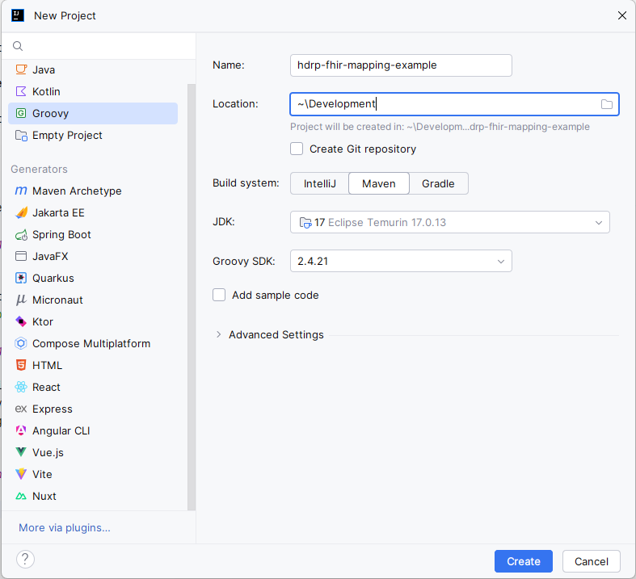
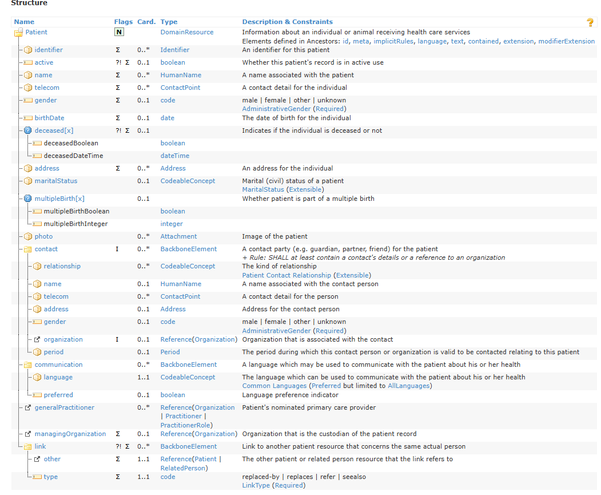

# Groovy Scripting with the HDRP FHIR-DSL

## Introduction

The HDRP was developed to enable HDRP users to create their custom transformations of HDRP entities into project-specific FHIR profiles. The DSL is
supporting that task by providing:

- FHIR Resource builders
- A Metamodel navigation to access HDRP entity elements effectively.

The DSL (domain-specific language) is written in Groovy and makes use of Groovy Closures. For the usage of the DSL, basic Java/Groovy knowledge is
profitable. This document will guide you through

- the setup of a development environment
- basic structure of a script
- common patterns for accessing and filtering data

## Setup

To profit from all the benefits of the DSL (FHIR resource building, HDRP Metamodel navigation), we recommend using an IDE with Groovy support.

**Requirements**:

- IDE with Maven and Groovy support (IntelliJ, Eclipse)
- JDK >= 1.8
- Maven
- Groovy 2.4.21

The current test project was tested on a Windows 11 machine with Maven 3.6.3, Eclipse Temurin 17 JDK with the default language level.

### Downloading IntelliJ

The IntelliJ Community edition is enough. You can download it [here](https://www.jetbrains.com/idea/download/)

### Setting up Maven

IntelliJ itself comes with a bundled Maven. If you want to use that Maven from the command line, you will have to add the IntelliJ Maven to the Path
variable ```<IntelliJ>\plugins\maven\lib\maven\bin```. You can also install your own Maven, Maven can be downloaded
from [here](https://maven.apache.org/download.cgi).
Installation instructions can be found [here](https://maven.apache.org/install.html). To configure the custom Maven in IntelliJ, set the Maven home
Path to
```<custom-maven>\bin``` in <span style="color: darkblue"> Setting -> Build, Execution, Deployment -> Build Tools -> Maven</span>.

### Setting up JDK

You can install the JDK following the [installation instructions](https://adoptium.net/installation/). The JDK must be configured in IntelliJ under
<span style="color: darkblue"> Project Structure... → Project Settings → Project</span>. Set the SDK the installation location of your JDK. If you did
not change the default, it should look like ```C:\Program Files\Eclipse Adoptium\jdk-17.0.13.11-hotspot```

## Creating a Project

### Option 1: Create a fresh mapping project

Create a new Project in IntelliJ, Select Groovy on the left and Maven as the Build System. Set the Groovy SDK version to 2.4.21.



If you did not set your JDK already in the previous dialog, you can set it as described [here](#setting-up-jdk).

To install the dialog FHIR-DSL library, add the dependency and the repository to your ```pom.xml```.

```xml

<dependencies>
  <dependency>
    <groupId>de.kairos</groupId>
    <artifactId>kairos-fhir-dsl</artifactId>
    <version>1.49.0</version>
  </dependency>
</dependencies>
<repositories>
<repository>
  <id>github-kairos-fhir</id>
  <name>GitHub kairos-fhir Apache Maven Packages</name>
  <url>https://maven.pkg.github.com/kairos-fhir/kairos-fhir-dsl-mapping-example</url>
</repository>
</repositories>
```

Since GitHub only allows authorized access to the package, a general access token is supplied in the [`settings.xml`](../settings.xml).
Create your own ```settings.xml``` and configure your Maven to use it. Go to
<span style="color: darkblue"> Setting → Build, Execution, Deployment → Build Tools → Maven</span>,
check the "Override" box under "User settings file" and select the path to `<project>/settings.xml`.

Now go to the maven menu on the right and <span style="color: darkblue"> [project name] → Lifecycle → Install → Maven</span> or execute

```
mvn install -s <path to custom settings xml>
```

### Option 2: Clone This Example Project

Download the source code of this project or clone the project:

```
git clone https://github.com/kairos-fhir/kairos-fhir-dsl-mapping-example.git
```

Open the project in IntelliJ. Configure your Maven and JDK as described in sections [Setting up Maven](#setting-up-maven) and
[Setting up JDK](#setting-up-jdk), respectively.

Now go to the maven menu on the right and <span style="color: darkblue"> [project name] → Lifecycle → Install → Maven</span> or execute

```
mvn install -s <path to custom settings xml>
```

## Using the FHIR DSL

Simplified, a Groovy script is a method (function) that takes the HDRP entity objects graph as an argument and returns a FHIR resource.

The FHIR DSL provides entry methods for a subset of the domain resources defined by the FHIR specification. HDRP instantiates a Script class to which
the builder for the resource specified in the ```ExportResourceMappingConfig.json``` is assigned to. Calling the entry method with a closure will then
delegate to the assigned Builder. The builder is instantiated holding the context object, which is also provided by HDRP. The context contains the
`source`
element, which is the HashMap representing the HDRP entity object graph.

### Using the FHIR Resource Builders

The FHIR-DSL provides Resource Builders. These builders expose methods which reflect the FHIR structure definitions for the domain resources defined
in the FHIR standard. These methods accept a closure. [Groovy closures](https://groovy-lang.org/closures.html) may be a bit confusing at first. Groovy
allows omitting the parenthesis around method parameters. Therefore

```groovy
patient {
  // mapping
}
```

is equivalent to

```groovy
patient({
  // mapping
})
```

Since the `patient` entry method delegates to the `PatientBuilder`, the methods and properties declared by the builder are available in the scope of
the closure. The IntelliJ auto-completion is helpful to see what methods the resource builder exposes.

FHIR resources consist of complex types and primitive types.
Here is an example for the [FHIR Patient structure](https://hl7.org/fhir/R4/patient.html#resource)


We can build this structure using the FHIR DSL as follows:

```groovy
import de.kairos.centraxx.fhir.r4.utils.FhirUrls
import de.kairos.fhir.centraxx.metamodel.MaritalStatus
import org.hl7.fhir.r4.model.Extension
import org.hl7.fhir.r4.model.Patient
import org.hl7.fhir.r4.model.codesystems.AdministrativeGender

//calling the entry method to build a patient resource
patient {
  id = "Patient/1"

  // delegates to the IdentifierBuilder
  identifier {
    system = "urn:my-first-id"
    value = "some-id"
  }

  // adding a second identifier
  identifier {
    system = "urn:my-second-id"
    value = "another-id"
  }

  // assigning directly to a primitive type property of the builder
  birthDate = "2000-02-02"

  // using Builder for primitive type element
  gender {
    extension {
      url = "http://example/extension"
      valueString = "example"
    }
    value = AdministrativeGender.FEMALE
  }

  // delegates to CodeableConceptBuilder
  maritalStatus {
    coding {
      system = "http://example/CodeSystem/common-martial-statuses"
      code = "married"
    }
  }
}

```

We have to start the script by calling the entry method to build a Patient resource. In the closure, we can call
all the methods that are offered by the PatientBuilder. These methods correspond to the elements defined in
the FHIR Patient Resource definition.

For complex elements like `Identifier` or `Address`, the corresponding builder method will again delegate to a Builder for that element type,
in this case to IdentifierBuilder or AddressBuilder, respectively. These will then be used to build the
[Identifier](https://hl7.org/fhir/R4/datatypes.html#identifier) and [Address](https://hl7.org/fhir/R4/datatypes.html#Address),
respectively.

Primitive types can be assigned directly to the property of the builder, like the `birthDate`in the example. It may be necessary to set an extension
on a primitive type. Then you can set the value via the provided method that accepts a closure, in which it is possible to add extensions.
This is demonstrated for the `gender` element in the example above.

The FHIR resources define cardinalities for each element like `0...*` where `0` is the min cardinality and `*` is the max cardinality.
Elements with max cardinality 1 can be set only once. Calling the builder methods for such an element multiple times will
overwrite the previously set value. For elements with max cardinality `*` a call to a builder method will add an element to
the list of elements. In our example, we add two identifiers by calling the `identifier` method twice.

### Using the HDRP Meta Model

In the [previous section](#using-the-builders), the usage of the Builder was demonstrated. However, statically adding values is of no use.
In real world scenario, we would like to map actual HDRP data to these resources. This data is accessible via the `source` property
on the `context` element in the script.

If we have an ExportResourceMapping defined as

```json
{
  "selectFromCxxEntity": "DIAGNOSIS",
  "transformByTemplate": "condition",
  "exportToFhirResource": "Condition"
}
```

The `context.source` will contain a HashMap Diagnosis entity object graph. Here is a truncated example:

```json

{
  "id": 940,
  "creationdate": "2024-11-04T11:06:55.470+01:00",
  "entitySource": "CENTRAXX",
  "initialEntitySource": "CENTRAXX",
  "episode": {
    "id": 1962,
    "creationdate": "2024-11-04T11:01:07.017+01:00",
    "entitySource": "CENTRAXX",
    "initialEntitySource": "CENTRAXX",
    "patientcontainer": {
      "id": 3735,
      "creationdate": "2024-03-01T19:04:23.000+01:00",
      "entitySource": "CENTRAXX",
      "initialEntitySource": "CENTRAXX",
      "urlFragment": "b6f5d61f-39e0-41a5-b573-3ac3a61bfa47",
      "patientId": 20,
      "attributes": [],
      "anonymousId": 7402342890753676381,
      "organisationUnits": [
        {}
      ]
    }
  }
}

```

You can create your custom export script to write this map to the file system for testing purposes. An example is described
[here](#inspecting-the-contextsource-map)

For somebody without extensive knowledge of the HDRP data model, it is barely possible to know which fields will be present in that map.
For that reason the FHIR-DSL provided the HDRP Meta Model navigation. This feature combined with your IDEs auto-completion allows
you to navigate through this map. Let's do an example:

```groovy
import static de.kairos.fhir.centraxx.metamodel.RootEntities.diagnosis

condition {
  id = context.source[diagnosis().id()]

  onsetDateTime {
    date = context.source[diagnosis().diagnosisDate().date()]
  }
}
```

The Meta model is used by calling a static entry method from the `RootEntities` class. We can then use chained calls to access fields
in the map via the `getAt` method. Chained calls are null safe. That means `context.source[diagnosis().diagnosisDate().date()]` will return
null even if the element at `context.source[diagnosis().diagnosisDate()]` is null.

The MetaModel does also support static fields for each element that can be used to access fields on the respective elements.
That can come in handy if we are operating on collections in the `context.source` map.

```groovy


import de.kairos.fhir.centraxx.metamodel.PrecisionDate

import static de.kairos.fhir.centraxx.metamodel.RootEntities.diagnosis

condition {

  id = context.source[diagnosis().id()]

  // extracting the precision date map from the source
  final def precisionDate = context.source[diagnosis().diagnosisDate()]

  if (precisionDate != null) {
    // accessing the date field on the precision date map via static Meta model field
    recordedDate = precisionDate[PrecisionDate.DATE]
  }
}

```

> [!WARNING]
> Calling `getAt`(`[]`) with a static Meta Model property on a null object will cause a null pointer exception

## Examples for common scripting use cases

### Filtering Records To Export

A resulting resource will only be included in the resulting FHIR Bundle if a logical ID was assigned.
We can therefore filter out elements by returning before id assignment.

```groovy
import static de.kairos.fhir.centraxx.metamodel.RootEntities.patient

patient {
  final String hdrpFirstName = context.source[patient().firstName()]

  // filter all patients that are not named Alex
  if (hdrpFirstName != null && hdrpFirstName != "Alex") {
    return
  }

  id = "Patient/" + context.source[patient().id()]

  // further mappings
}

```

### Adding A FHIR Element For Each HDRP Element

Often we want to map each entry in a collection from the ```context.source```
to a FHIR element. For example, we want to add an identifier element for each
HDRP Patient ID. We can use the groovy `each` method for that.

```groovy
import de.kairos.fhir.centraxx.metamodel.IdContainer
import de.kairos.fhir.centraxx.metamodel.IdContainerType

import static de.kairos.fhir.centraxx.metamodel.RootEntities.patient

patient {

  id = "Patient/" + context.source[patient().id()]

  // calling identifier builder method for each IdContainer map in the context.source map
  context.source[patient().patientContainer().idContainer()].each { final def idc ->
    identifier {
      system = idc[IdContainer.ID_CONTAINER_TYPE][IdContainerType.CODE]
      value = idc[IdContainer.PSN]
    }
  }
}

```

### Filtering Collections

Sometimes we only want to export one specific element in a collection of the ```context.source``` For example, we want to add an identifier element
for each
HDRP Patient ID with a specific IdContainerType code. We can use the groovy 'find' method for that.

```groovy
import de.kairos.fhir.centraxx.metamodel.IdContainer
import de.kairos.fhir.centraxx.metamodel.IdContainerType

import static de.kairos.fhir.centraxx.metamodel.RootEntities.patient

patient {

  id = "Patient/" + context.source[patient().id()]

  // find IdContainerMap with code 'PATIENT_ID'
  final def idc = context.source[patient().patientContainer().idContainer()].find { final def idc ->
    "PATIENT_ID" == idc[IdContainer.ID_CONTAINER_TYPE][IdContainerType.CODE]
  }

  if (idc != null) {
    identifier {
      system = idc[IdContainer.ID_CONTAINER_TYPE][IdContainerType.CODE]
      value = idc[IdContainer.PSN]
    }
  }
}

```

Another case would be the export of all HDRP system-wide unique Patient IDs. We can achieve that using the  `findAll` method:

```groovy
import de.kairos.fhir.centraxx.metamodel.IdContainer
import de.kairos.fhir.centraxx.metamodel.IdContainerType
import de.kairos.fhir.centraxx.metamodel.enums.IdUniqueness

import static de.kairos.fhir.centraxx.metamodel.RootEntities.patient

patient {

  id = "Patient/" + context.source[patient().id()]

  // find IdContainerMap with code 'PATIENT_ID'
  context.source[patient().patientContainer().idContainer()].find { final def idc ->
    IdUniqueness.SYSTEM == idc[IdContainer.ID_CONTAINER_TYPE][IdContainerType.CODE]
  }.each { final def idc ->
    identifier {
      system = idc[IdContainer.ID_CONTAINER_TYPE][IdContainerType.CODE]
      value = idc[IdContainer.PSN]
    }
  }
}

```

### Defining Custom Methods

For better readability or reuse of a code snippet, you can define your own static methods in a Groovy script.
In the following example we define a method to map the HDRP gender to the FHIR AdministrativeGender:

```groovy


import de.kairos.fhir.centraxx.metamodel.enums.GenderType
import org.hl7.fhir.r4.model.codesystems.AdministrativeGender

import static de.kairos.fhir.centraxx.metamodel.RootEntities.patient

patient {

  id = "Patient/" + context.source[patient().id()]

  // find IdContainerMap with code 'PATIENT_ID'
  gender = mapGender(context.source[patient().genderType()] as GenderType)
}

static AdministrativeGender mapGender(final GenderType genderType) {
  switch (genderType) {
    case GenderType.MALE:
      return AdministrativeGender.MALE
    case GenderType.FEMALE:
      return AdministrativeGender.FEMALE
    case GenderType.UNKNOWN:
      return AdministrativeGender.UNKNOWN
    default:
      return AdministrativeGender.OTHER
  }
}

```

### Inspecting the context.source Map

When you have your own HDRP instance, you likely want to know which fields
are actually available in the serialized HashMap, when exporting a dataset that you created
via the HDRP UI or imported otherwise.

You can run an export using a script like that:

```groovy
import com.fasterxml.jackson.databind.ObjectMapper
import de.kairos.fhir.centraxx.metamodel.RootEntities

final String path = "<path>"
condition {

  final def id = context.source[RootEntities.diagnosis().id()]

  new ObjectMapper().writerWithDefaultPrettyPrinter()
      .writeValue(new File(path + "/" + id), context.source)

}
```

If you use your own project, you need to add the jackson library to the `pom.xml`

## Testing

# Testing
## Intro
The project supports testing scripts using context maps that represent the CXX source data and the Groovy script. Given the flexible nature of CXX
source data, where fields may or may not be present, the testing framework is designed to run test scripts over a variety of different source data
sets. This approach ensures comprehensive test coverage and validates the transformation of CXX data to FHIR resources.

The project supports testing scripts using context maps that represent the CXX source data and the Groovy script.
The CXX test data needs to be provided as a JSON file containing an array of maps for each instance of a CXX entity. To create a test, extend the
`AbstractExportScriptTest` class and annotate the test class with the `@TestResources` annotation. The annotation takes
two arguments: `groovyScriptPath` and `contextMapsPath`, which are the paths to the Groovy script to test and the JSON file
with the CXX entity map data, respectively.

``` 
@TestResources(
  groovyScriptPath = "src/main/groovy/projects/mii_bielefeld/encounter.groovy",
  contextMapsPath = "src/test/resources/projects/mii_bielefeld/encounter.json"
)
class EpisodeExportScriptTest extends AbstractExportScriptTest<Encounter> {}
```

The `AbstractExportScriptTest` class will load the array if context map and the Groovy script, then apply the script to the given map. The context map
and the resulting resource are provided as arguments and can be used in each test method to run assertions. Annotate each test method with the
`@ExportScriptTest` annotation and declare the method parameters like this:

```groovy
@ExportScriptTest
void testThatClassIsSet(final Context context, final Encounter resource) {
  Assumptions.assumeTrue(context.source[episode().stayType()] != null)

  assertTrue(resource.hasClass_())
  assertEquals("http://terminology.hl7.org/CodeSystem/v3-ActCode", resource.getClass_().getSystem())
  assertEquals(context.source[episode().stayType().code()], resource.getClass_().getCode())
}
```

The test will then be run for each pair of the context map (CXX/HDRP entity object graph) and the resulting FHIR resource. The ´@ExportScriptTest´
annotation indicates that the test function is run parametrized and the arguments are provided by AbstractExportScriptTest class.
The number of test runs will be the number of tests annotated with the annotation times the number of CXX/HDRP entity maps given in the JSON file.

## Resource validation
Additionally, HAPI validation can be used to validate the resulting resources against certain FHIR profiles. The required FHIR packages need
to be provided in a separate folder. Annotate the test with the `@Validate` annotation like this:

```groovy
@TestResources(
  groovyScriptPath = "src/main/groovy/projects/mii_bielefeld/encounter.groovy",
  contextMapsPath = "src/test/resources/projects/mii_bielefeld/encounter.json"
)
@Validate(packageDir = "src/test/resources/fhirpackages")
class EpisodeExportScriptTest extends AbstractExportScriptTest<Encounter> {}
```
The test will load all package files from the given path and instantiate a HAPI validator. All resources created during the transformation will be
validated.

If the validation fails, the whole test will fail with a `ClassConfiguration` error. The validation message with errors will be displayed in the stack
traces.

Remember that for proper validation, you have to specify the profile a resource should be compliant with in the meta element.

## Where to get the test maps from
Currently, you would have to print the context map into the server log when testing with your local HDRP instance.
Alternatively, you can write the map to the file system using jackson as described [here](#inspecting-the-contextsource-map).


## Considerations for validation
The validation may fail when the profiling declares fields as mandatory, which are optional in CXX and, therefore, may not be present.
Ensure that the test data in CXX is complete and compliant with the FHIR profiling requirements.


