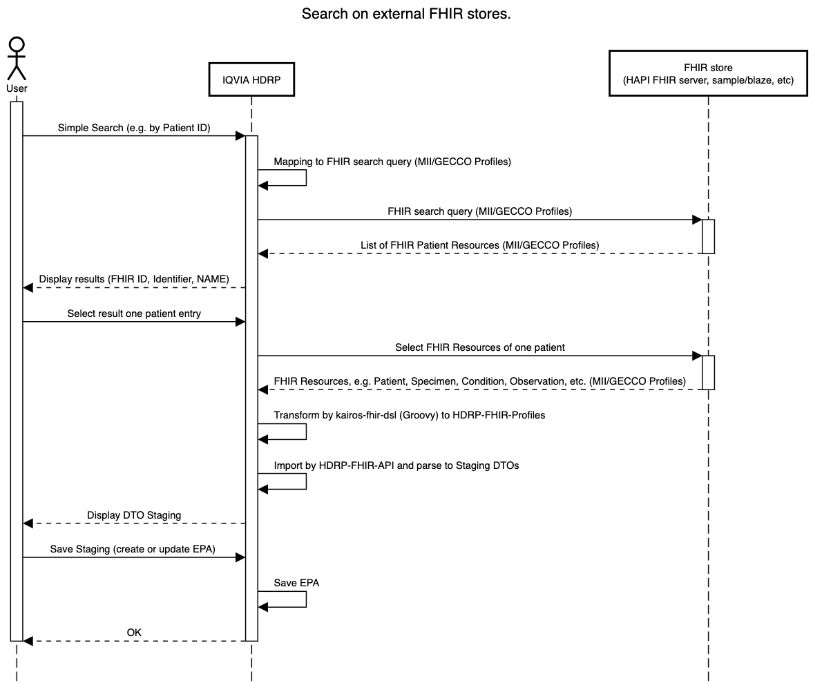

# FHIR Repository Connect — Import Mapping Examples

This directory contains example Groovy mappings that connect an external FHIR store to IQVIA Health Data Research Platform (HDRP) using
project‑specific FHIR profiles. This allows to import FHIR data with any FHIR R4 profiling into HDRP.

- Target profile: https://simplifier.net/centraxx-structures/
- Use these examples as a starting point and adapt or combine them for your custom import pipelines.
- Feedback is welcome via email, GitHub issues, or pull requests.
- The current implementation supports the import of following FHIR resource types into HDRP entities:
  - Patient ->  PatientContainer, PatientMasterData, Patient IDContainer
  - Encounter -> Episodes, EpisodeIdContainer
  - Consent -> Consent
  - Observation -> LaborFinding (Type Patient), LaborFindingLaborValue
  - Condition -> Diagnosis
  - Procedure -> MedProcedure
  - Specimen -> MasterSample, DerivedSample, AliquotGroup

## Principles

- In HDRP, the user always selects exactly one patient from the Repository Connect FHIR search to stage, merge, and import. Each source bundle should
  therefore include a single Patient resource.
- You may transform multiple resources at once, but the result must contain exactly one patient bundle entry.
- All other resources from all bundles/scripts are attached to the first (selected) patient; additional patients are ignored.
- Transformations can live in one or multiple scripts; this project demonstrates a multi‑script setup for clarity.
- Because Repository Connect loads only resources related to the selected patient, you generally do not need to re‑filter by subject or add subject
  references. Moving data between patients is not intended.

## Sequence diagram

